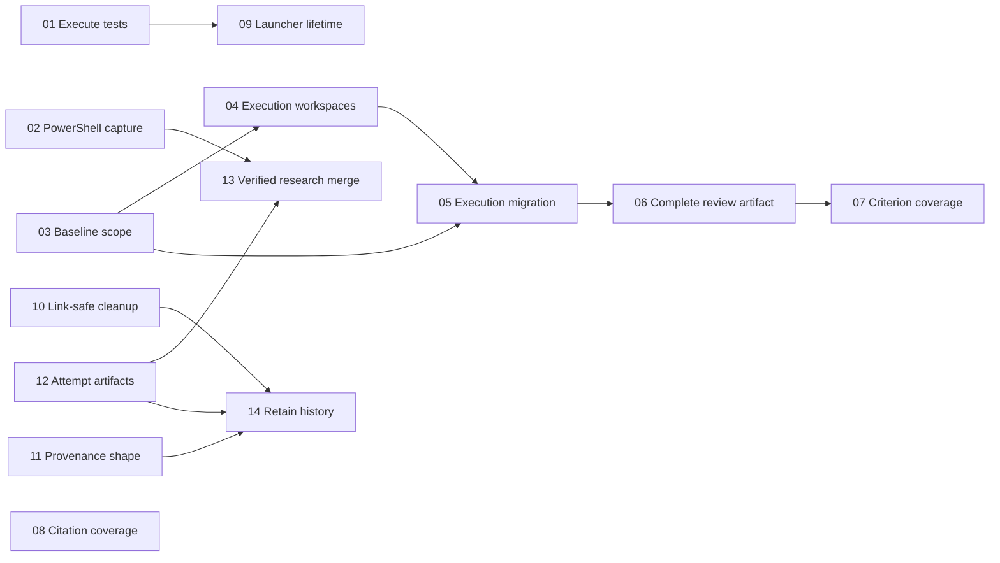

# Offload review remediation tickets

Drafted 2026-09-03 from the [whole-skill review](evidence/review.md) of revision `cfc9f4e`. All 14 tickets are now published as GitHub issues, covering all 13 confirmed findings. No implementation has started. GitHub is the active issue tracker.

## GitHub issues

| Local ticket | Published issue |
| --- | --- |
| 01 | [#3: Execute every PowerShell model-routing test group](https://github.com/anthonyandrei/offload/issues/3) |
| 02 | [#4: Make documented PowerShell research handoffs return usable values](https://github.com/anthonyandrei/offload/issues/4) |
| 03 | [#5: Check committed and working-tree edits against a fixed baseline](https://github.com/anthonyandrei/offload/issues/5) |
| 04 | [#6: Add a verified lifecycle for isolated execution worktrees](https://github.com/anthonyandrei/offload/issues/6) |
| 05 | [#7: Run execution stages through isolated workspaces and retire shared-tree dispatch](https://github.com/anthonyandrei/offload/issues/7) |
| 06 | [#8: Review one complete change artifact against the execution baseline](https://github.com/anthonyandrei/offload/issues/8) |
| 07 | [#9: Require one valid reviewer verdict for every requested criterion](https://github.com/anthonyandrei/offload/issues/9) |
| 08 | [#10: Require audit coverage for every claim and citation pair](https://github.com/anthonyandrei/offload/issues/10) |
| 09 | [#11: Prevent orphaned workers when PowerShell output setup fails](https://github.com/anthonyandrei/offload/issues/11) |
| 10 | [#12: Keep PowerShell cleanup inside the marked workspace](https://github.com/anthonyandrei/offload/issues/12) |
| 11 | [#13: Make routing provenance examples match both validators](https://github.com/anthonyandrei/offload/issues/13) |
| 12 | [#14: Give every worker attempt distinct evidence paths](https://github.com/anthonyandrei/offload/issues/14) |
| 13 | [#15: Continue synthesis from verified successful research angles](https://github.com/anthonyandrei/offload/issues/15) |
| 14 | [#16: Preserve routing history and explain pruned evidence after success](https://github.com/anthonyandrei/offload/issues/16) |

## Breakdown

| Ticket and deliverable | Priority | Blocked by | Findings |
| --- | --- | --- | --- |
| [01. Execute every PowerShell model-routing test group](issues/01-execute-model-routing-tests.md) | P2 | None | F-09 |
| [02. Make documented PowerShell research handoffs return usable values](issues/02-capture-powershell-research-output.md) | P1 | None | F-01 |
| [03. Check committed and working-tree edits against a fixed baseline](issues/03-verify-baseline-relative-scope.md) | P1 | None | F-03, F-06 |
| [04. Add a verified lifecycle for isolated execution worktrees](issues/04-add-isolated-execution-workspaces.md) | P1 | 03 | F-02 |
| [05. Run execution stages through isolated workspaces and retire shared-tree dispatch](issues/05-migrate-execution-to-isolated-workers.md) | P1 | 03, 04 | F-02, F-03 |
| [06. Review one complete change artifact against the execution baseline](issues/06-review-complete-change-artifacts.md) | P1 | 05 | F-04 |
| [07. Require one valid reviewer verdict for every requested criterion](issues/07-require-complete-reviewer-verdicts.md) | P1 | 06 | F-05 |
| [08. Require audit coverage for every claim and citation pair](issues/08-require-complete-citation-audits.md) | P1 | None | F-05 |
| [09. Prevent orphaned workers when PowerShell output setup fails](issues/09-close-launcher-failure-lifetime.md) | P2 | 01 | F-07 |
| [10. Keep PowerShell cleanup inside the marked workspace](issues/10-avoid-following-cleanup-links.md) | P2 | None | F-08 |
| [11. Make routing provenance examples match both validators](issues/11-align-routing-provenance-examples.md) | P2 | None | F-11 |
| [12. Give every worker attempt distinct evidence paths](issues/12-preserve-per-attempt-artifacts.md) | P2 | None | F-13 |
| [13. Continue synthesis from verified successful research angles](issues/13-merge-only-verified-research-attempts.md) | P2 | 02, 12 | F-12 |
| [14. Preserve routing history and explain pruned evidence after success](issues/14-retain-routing-history-after-cleanup.md) | P2 | 10, 11, 12 | F-10 |

Each ticket contains its own problem, deliverable, atomic acceptance checklist, file pointers, and verification steps. Numbering is a valid topological publication order, not a requirement to finish every earlier number first.

## Publication design

Use isolated Git worktrees for writing workers. Tickets 03 and 04 add baseline verification and workspace helpers beside the current behavior. Ticket 05 migrates gate authors and implementers, then removes the old no-baseline and shared-tree paths. Tickets 06 and 07 complete the diff-review path. This avoids one oversized execution rewrite.

Keep success-time pruning of raw research artifacts, but retain routing history and a small evidence disposition manifest. Ticket 14 records which referenced files were present, retained, missing, or pruned, with content hashes where inspection is safe. The report will no longer imply that a deleted path still provides inspectable evidence.

Split F-05 into execution criterion coverage and web citation coverage. They require different input identities and acceptance checks. Combine F-03 with F-06 because both fix the same paired scope helpers and their failure contract.

No separate general refactor is required. Ticket 01 repairs dormant tests; it is not a blanket blocker for unrelated helpers.

Published at the user's request. Blockers in the issue bodies link to actual GitHub issue numbers. Existing issues were left unchanged.

## Dependency graph

## Scheduling

Unblocked issues corresponding to tickets 01, 02, 03, 08, 10, 11, and 12 carry ready-for-agent. Every issue also carries bug and review-remediation.

Start with 02 and 03 for the broken research and execution paths, and 01 to restore confidence in the routing test suite. Ticket 08 can proceed independently. Continue the execution chain through 07 before relying on automated diff-gate acceptance.

Dependencies express behavior prerequisites. File ownership still limits parallel dispatch. Several tickets edit `modes/web-research.md`, `SKILL.md`, and shared test files. Serialize those edits or use isolated branches with deliberate integration. Ticket 12 also overlaps execution-mode edits in 05 through 07.

Do not use the currently broken shared-tree offload execution workflow to implement this plan. Use direct orchestration or independently verified isolated checkouts until ticket 05 is complete. An unblocked source-edit ticket can still be delayed by a concrete regression exposed by ticket 01.

## Shared constraints

- Work in the source repository. Leave `C:/Users/antho/.codex/skills/_offload` unchanged until a separately requested installation/update step.
- Preserve the Gemini model policy, role routing, one-retry ceiling, and immediate quota handoff.
- Preserve shell parity. Bash remains compatible with 3.2+ and its existing dependencies. Native Windows requires PowerShell 7, Git, and AGY, with no Bash, Python, or jq dependency.
- Keep `SKILL.md` as a router under 500 lines; put detailed contracts and workflow instructions in their proper files.
- Treat plan mode and worktrees as workflow controls, not enforceable OS write barriers.
- Prefer fake workers and disposable repositories for regression checks. A live paid worker run or broad model comparison is unnecessary for these fixes.
- Before destructive fixture cleanup, resolve and verify absolute paths within the intended disposable root. Never reset or clean the user's checkout to simplify a test.
- Record the actual shells/platforms exercised. The review ran PowerShell 7 and Git Bash on Windows; native Linux, macOS, and Bash 3.2 were not exercised.
- Each ticket must demonstrate its stated behavior, including the negative case that exposed the defect. Do not substitute a text search for a runtime verification requirement.
- Parent tracker items must remain unchanged if these tickets are later published.

## Finding coverage

| Finding | Tickets |
| --- | --- |
| F-01 | [02](issues/02-capture-powershell-research-output.md) |
| F-02 | [04](issues/04-add-isolated-execution-workspaces.md), [05](issues/05-migrate-execution-to-isolated-workers.md) |
| F-03 | [03](issues/03-verify-baseline-relative-scope.md), [05](issues/05-migrate-execution-to-isolated-workers.md) |
| F-04 | [06](issues/06-review-complete-change-artifacts.md) |
| F-05 | [07](issues/07-require-complete-reviewer-verdicts.md), [08](issues/08-require-complete-citation-audits.md) |
| F-06 | [03](issues/03-verify-baseline-relative-scope.md) |
| F-07 | [09](issues/09-close-launcher-failure-lifetime.md) |
| F-08 | [10](issues/10-avoid-following-cleanup-links.md) |
| F-09 | [01](issues/01-execute-model-routing-tests.md) |
| F-10 | [14](issues/14-retain-routing-history-after-cleanup.md) |
| F-11 | [11](issues/11-align-routing-provenance-examples.md) |
| F-12 | [13](issues/13-merge-only-verified-research-attempts.md) |
| F-13 | [12](issues/12-preserve-per-attempt-artifacts.md) |

The review also suggested a minor description edit to align the trigger wording with distinct work lanes. It is a nonblocking editorial follow-up, outside these confirmed-defect tickets. Rejected and unverified claims from the audit are excluded.

## Evidence and validation

The `evidence/` directory contains a copy of the full audit, its verification decisions, reproduction logs, and the list of dormant test groups. Original temporary paths inside the copied report describe the audit run. Use the copies here for durable ticket context.

Reproduction scripts are not copied as executable instructions. New regression fixtures must be disposable and must not reuse the original audit workspace.

`tickets.json` records ticket IDs, dependencies, priorities, findings, and acceptance criteria for mechanical checks. The accompanying `validation.json` records this draft's coverage and dependency validation.

Publication details are recorded in [github-issues.json](github-issues.json). [github-publication.json](github-publication.json) confirms all 14 remote bodies, open states, blocker links, and readiness labels were read back and verified.
